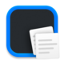
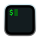
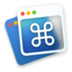

<h3 align="center"><i>Elevate your Mac experience</i></h3>

## Table of contents
- [1. Mac Essentials](#1-mac-essentials)
- [2. Mac Apps](#2-mac-apps)
- [3. Essential CLI](#3-essential-cli)
- [4. Extra](#4-extra)
  - [4.1 Raycast Extensions](#41-raycast-extensions)

## 1. Mac essentials

### [Dropover](https://dropoverapp.com/)
Improves drag and drop experience. No need for two Finder windows.
 

 
Preview

 

---

### [Glance](https://apps.apple.com/app/id1564688210)
More quick look previews. Works with zip, yaml, and many more.

Preview

---

### [CleanMyMac X](https://cleanmymac.com/)  
Useful for uninstalling and cleaning up garbage.

Preview

---

### [CleanShot X](https://cleanshot.com/)  
Snipping tool replacement, useful for annotating screenshots.

Preview

---

### [Fig](https://fig.io/)
Auto suggestions in terminal. Unfortunately, an account is required to use this app.

Preview

---

### [OpenInTerminal-Lite](https://github.com/Ji4n1ng/OpenInTerminal)
Create a button in finder to open the current directory in a terminal.

Preview

---

### [MonitorControl](https://github.com/MonitorControl/MonitorControl)
Use keyboard brightness buttons to change the brightness of the display where your cursor is.

Preview

---

### [Bartender](https://www.macbartender.com/)  
Hide icons in the tab bar. Great open source alternative: [hidden](https://github.com/dwarvesf/hidden).

Preview

---

### [Little Snitch](https://www.obdev.at/products/littlesnitch/index.html)  
Network monitoring and firewall, for the control freaks.

Preview

---

### [Raycast](https://www.raycast.com/)
Apple Spotlight replacement. Much faster and lots of extensibility

Preview

---

### [iTerm2](https://iterm2.com/)
Terminal replacement.

---

### [f.lux](https://justgetflux.com/)
Makes screen more orange during the night, prevents eye strain.

Preview

---

### [Magnet](https://magnet.crowdcafe.com/)  
Window manager. See [Rectangle](https://rectangleapp.com/) for open source alternative.

---

### [MOS](https://mos.caldis.me/)
Use your side buttons and different scrolling on an external mouse.

---

### [Command-Tab Plus](https://noteifyapp.com/command-tab-plus/)  
I use this to hide apps from the app switcher that are on other desktops/minimized.

---

## 2. Mac Apps

## 3. Essential CLI

Homebrew

ffmpeg

imagemagick

## 4. Extra

### 4.1 Raycast Extensions

Clipboard history
