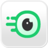

# Mac apps

Mac essentials

| **Icon** | **App** | **Description** | **Cost** |
| --- | --- | --- | --- |
|  | [Dropover](https://dropoverapp.com/) | Improves drag and drop experience, no need for 2 finder windows | LIMITED |
|  | [Glance](https://apps.apple.com/app/id1564688210) | More quick look previews (zip, yaml, etc) | FREE |
|  | [CleanMyMac X](https://cleanmymac.com/) | Useful for uninstalling and cleaning up garbage | PAID |
|  | [CleanShot X](https://cleanshot.com/) | Snipping tool replacement, useful for annotating screenshots | PAID |
|  | [Fig](https://fig.io/) | Auto suggestions in terminal. Unfortunately an account is required to use this app | FREE |
|  | [OpenInTerminal-Lite](https://github.com/Ji4n1ng/OpenInTerminal) | Create a button in finder to open the current directory in a terminal | FREE |
|  | [MonitorControl](https://github.com/MonitorControl/MonitorControl) | Use keyboard brightness buttons to change the brightness of the display where your cursor is | FREE |
|  | [Bartender](https://www.macbartender.com/) | Hide icons in the tab bar. Great open source alternative: [hidden](https://github.com/dwarvesf/hidden) | PAID |
|  | [Little Snitch](https://www.obdev.at/products/littlesnitch/index.html) | Network monitoring and firewall, for the control freaks | PAID |
|  | [Raycast](https://www.raycast.com/) | Apple Spotlight replacement | FREE |
|  | [iTerm2](https://iterm2.com/) | Terminal replacement | FREE |
|  | [f.lux](https://justgetflux.com/) | Makes screen more orange during the night, prevents eye strain | FREE |
|  | [Magnet](https://magnet.crowdcafe.com/) | Window manager. See [Rectangle](https://rectangleapp.com/) for open source alternative. | PAID |
|  | [MOS](https://mos.caldis.me/) | Use your side buttons and different scrolling on an external mouse | FREE |
|  | [Command-Tab Plus](https://noteifyapp.com/command-tab-plus/) | I use this to hide apps from the app switcher that are on other desktops / minimised | PAID |

Useful mac apps:

CLI tools:

Homebrew

ffmpeg

imagemagick

Raycast extensions:

Clipboard history
